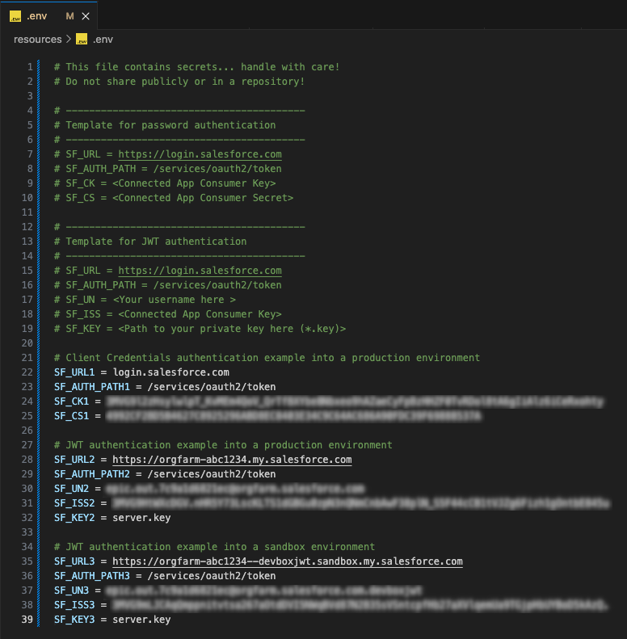
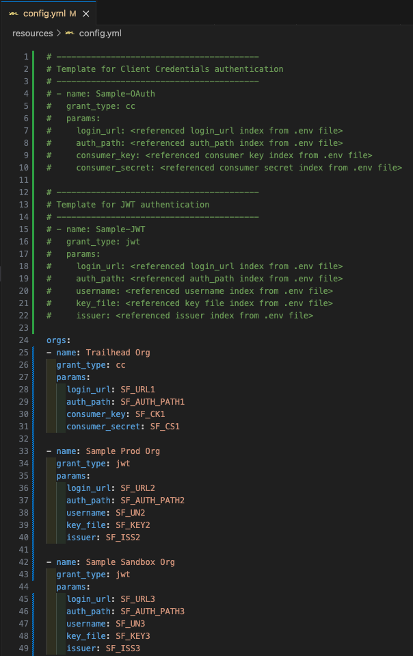
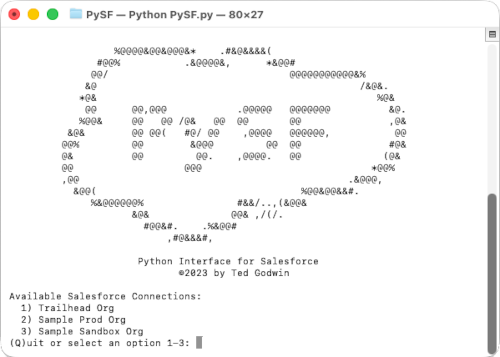
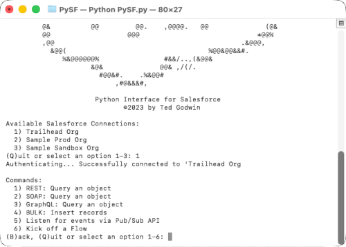
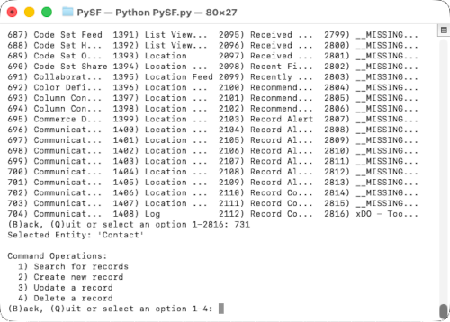
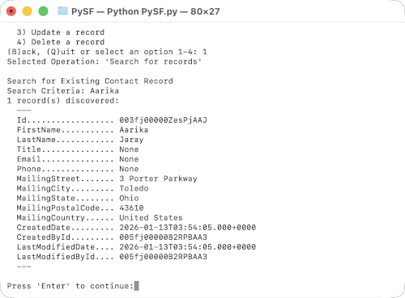
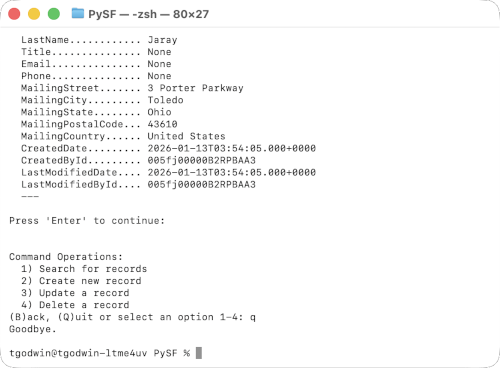

                  %@@@@&@@&@@@&*    .#&@&&&&(
               #@@%           .&@@@@&,      *&@@#
              @@/                               @@@@@@@@@@@&%
             &@                                             /&@&.
            *@&                                                %@&
             @@      @@,@@@            .@@@@@   @@@@@@@          &@.
            %@@&     @@   @@ /@&   @@  @@       @@               ,@&
          &@&        @@ @@(   #@/ @@    ,@@@@   @@@@@@,           @@
         @@%         @@        &@@@         @@  @@               #@&
         @&          @@         @@.    ,@@@@.   @@              (@&
         @@                   @@@                             *@@%
         ,@@                                              .&@@@,
           &@@(                                   %@@&@@&&#.
              %&@@@@@@%                #&&/..,(&@@&
                     &@&              @@& ,/(/.
                       #@@&#.    .%&@@#
                           ,#@&&&#,

                      Python Interface for Salesforce

# PySF
1. [Introduction](#introduction)
2. [Prerequisites](#prerequisites)
3. [Setup](#setup)
4. [Usage](#usage)
5. [Considerations](#considerations)

## Introduction
This is a simple Python script that can be used to test authentication into one or more Salesforce orgs.  PySF supports the two primary authentication types:
1. **Client Credentials**: an authentication flow in the OAuth 2.0 framework
2. **JWT Bearer Flow**: a secure, signed format for an access token 

Aside from authentication, roadmap items include actions:
- Query objects via REST, SOAP, BULK, GraphQL, etc.
- Listen for events via Pub/Sub API
- Kick off an automated process such as a Flow or Apex class

## Prerequisites:
- Python 3.8 or higher
- pip3 (`python3 -m pip3 install --upgrade pip`)
- requests (`pip3 install requests`)
- dotenv (`pip3 install python-dotenv`)
- PyYAML (`pip3 install PyYAML`)
- PyJWT (`python3 -m pip install pyjwt cryptography requests`)

## Setup: The following 2 files must be configured

### resources/.env
This file is responsible for keeping and referencing sensitive information. Depending upon your authentication type, input parameters may vary (see table below). Paramteers for multiple connections can be defined and each parameter is represented by a key/value pair.  These parameters are referenced by their keys in the resource/config.yml file.

| Client Credentials Authentication Parameters | |
| ----------- | ----------- |
| Login URL | Org's current My Domain or http://login.salesforce.com  |
| Auth Path | /services/oauth2/token |
| Consumer Key | The consumer key defined by the external app |
| Consumer Secret | The consumer secret defined by the external app |

| JWT Bearer Flow Authentication Parameters | |
| ----------- | ----------- |
| Login URL | Org's current My Domain or http://login.salesforce.com  |
| Auth Path | /services/oauth2/token |
| User Name | The acting user name accessing the org |
| Issuer | The consumer key defined by the external app |
| Key File | Path to your private key file (*.key) |

== **Special Note**: This file contains sensitive authentication credentials in plain text! Do not share publicly or in a repository! ==




### resources/.config.yml
This file is responsible for connecting the sensitive information found in the .env with the script itself.  These parameters are defined in the table below.

| Org Config Parameters | |
| ----------- | ----------- |
| Name | A name describing what org you're connecting to  |
| Grant Type | This is either cc (Client Credentials) or JWT (JWT Bearer Flow) |
| Params | The parameter key values defined in the .env file |




### Usage
PySF is a command line interface. Open your terminal console, navigate to the directory it is installed, and simply type the following command:

```> python3 PySF.py```

The following screen will be displayed along with a list of connections defined in your config.yml file.




Selecting one of the connectoins will present a set of options availble options for that connection.




For this example, we have selected option ```1) REST: Query an object``` which displays all available objects.  From here we are presented with another set options.  We choose ```1) Search for records```.




Typing in search criteria (contact's first name) will produce results, displayed on the screen.




Typing 'Q' at eny point will termintate the script and return you to the command prompt.




## Considerations:

This script is a simply utility that is still a work in progress.